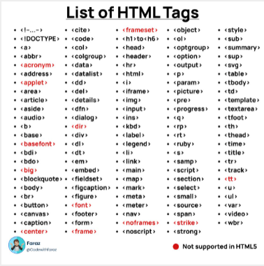
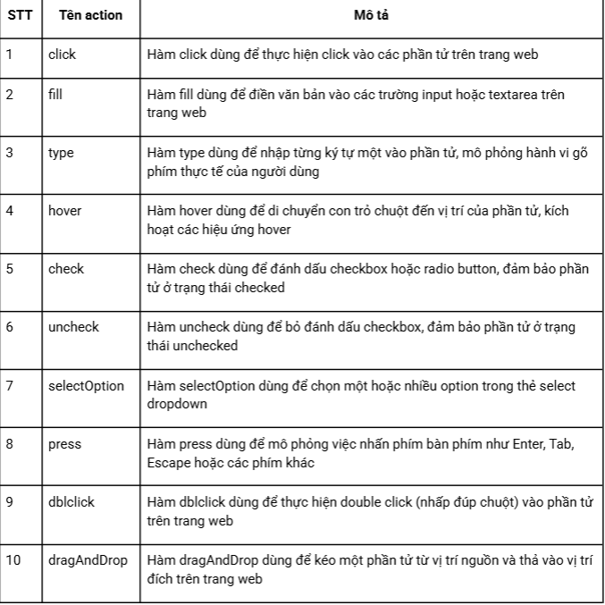

1. Cấu trúc DOM cơ bản: gồm thẻ đóng và thẻ mở

2. Cấu trúc html của 1 bảng:
<html>: thẻ gốc của trang
<head>: chứa metadata: tiêu đề website, hiển thị Google
<body>: nội dung của cả website hiển thị

: container chung
: inline container
<header>, <footer>, <nav>, <section>: thẻ ngữ nghĩa

3. Selector
- Xpath
- CSS selector
- Playwright selector
    Chỉ dùng riêng cho Playwright
    Cú pháp ngắn gọn, ko phụ thuộc vào cấu trúc DOM
    Hướng tới "giống người dùng đang nhìn thấy gì"
    VD: page.getByText("Add to cart");

Độ ưu tiên xài: Playwright selector > CSS > Xpath

4. Playwright cơ bản
